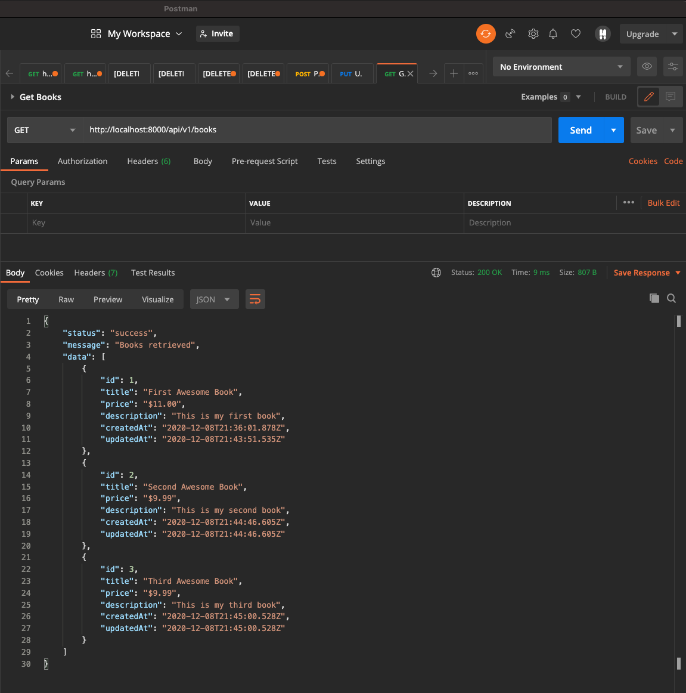
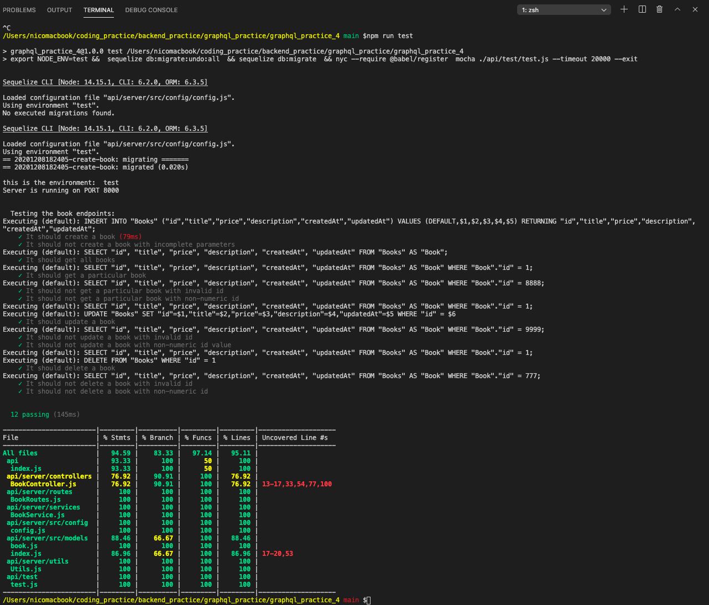

# Restful API with NodeJS, Express, PostgreSQL, Sequelize, Travis, Mocha, Coveralls and Code Climate

## Coding practice project

### [Tutorial: Restful API with NodeJS, Express, PostgreSQL, Sequelize, Travis, Mocha, Coveralls and Code Climate](https://medium.com/@victorsteven/restful-api-with-nodejs-express-postgresql-sequelize-travis-mocha-coveralls-and-code-climate-f28715f7a014) by [Victor Steven](https://medium.com/@victorsteven?source=post_page-----f28715f7a014--------------------------------)

This tutorial was very interesting. The author provides a step by step guide to implement this app with his code version and images to support the explanations. 
I found it very useful and a good example for my first time generating APIs using this stack.

To complete the tutorial the instructors explains how to set up the project in Travis CI, Coveralls, and CodeClimate.
Following his instructions I obtained the badges you can se below:

 

## Screenshots

   
  <small>Postman Sample Query</small>

   
  <small>Terminal Test Output Sample</small>

